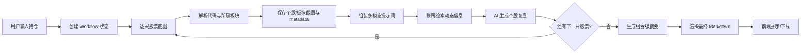

# Stock Daily Review

Stock Daily Review 是一个运行在本机的 A 股个人持仓自动复盘工作台。你只需要输入股票名称或代码、成本价、持股数量和计划持有周期，系统会自动完成：

1. 打开东方财富行情页并截取个股交易数据、分时图、五档盘口、日 K 线；
2. 识别并截取所属行业/板块数据；
3. 可选 Gemini / 智谱多模态复盘，或使用不依赖模型 Key 的本地规则复盘；
4. 生成每只股票的个股复盘、组合级摘要和最终 Markdown 文档；
5. 通过本地前端展示执行进度、失败原因、复盘内容和下载入口。

项目重点是**可恢复、可观测、可审计**：每一步都会落盘，模型配额耗尽或网络中断后，不需要重新截图，可以从断点继续。

> 本项目输出内容仅用于个人研究、复盘和信息整理，不构成投资建议。模型可能出错，交易前请自行核实关键数据。

---

## 目录

- [核心能力](#核心能力)
- [项目结构](#项目结构)
- [快速启动](#快速启动)
- [前端使用](#前端使用)
- [命令行使用](#命令行使用)
- [自动复盘流程](#自动复盘流程)
- [输出结果](#输出结果)
- [HTTP API 概览](#http-api-概览)
- [失败恢复](#失败恢复)
- [安全与隐私](#安全与隐私)
- [测试](#测试)
- [常见问题](#常见问题)

---

## 核心能力

| 能力 | 说明 |
| --- | --- |
| 持仓输入 | 前端表单输入，或 CLI 读取 `my_stock.txt` |
| 行情截图 | 自动解析股票名称/代码，抓取东方财富个股与板块数据 |
| 多模态 AI 复盘 | 将截图和持仓信息交给 Gemini / 智谱模型，生成技术面、板块、大事和仓位计划 |
| 本地规则复盘 | 不调用 Gemini / 智谱，基于搜狐与东方财富公开接口计算盈亏、均线、RSI、量能、形态/趋势定义、趋势强度与趋势变化、支撑/压力区域、板块、最新股东人数、融资融券余额与组合风险 |
| 周策略执行单 | 周五收盘后或周末基于日线/周线截图提前生成下一周策略；包含形态/趋势定义、趋势强度与变化、支撑/压力区域、左侧/右侧买入信号、指标搭配与止损线，周内每日自动回顾 |
| 每日操作复盘 | 读取 `my_stock.txt` 中紧跟持仓行的当日买卖记录，评价成交价、执行纪律并给出后续动作 |
| 动态信息检索 | 支持智谱 Web Search 或模型内置搜索，并在复盘中附带来源 |
| 组合摘要 | 汇总多只个股复盘，生成组合级别观察和风险提示 |
| 可恢复工作流 | 每只股票独立记录截图/AI 状态，失败后可断点重试 |
| 前端控制台 | 一键自动复盘、轮询进度、查看事件流、阅读或下载 Markdown |
| 本地 API | 提供健康检查、创建任务、查询状态、重试、渲染和获取文档接口 |

---

## 项目结构

后端采用分层架构，业务规则、应用编排、基础设施适配和接口协议分离：

```text
.
├── review_workflow/
│   ├── domain/            # 领域模型、配置、最终 Markdown 渲染器
│   ├── application/       # Workflow Agent、应用服务、端口定义
│   ├── infrastructure/    # JSON 状态存储、旧脚本适配器
│   └── interfaces/        # CLI、HTTP API、OpenAPI
├── frontend/              # 零 npm 依赖的静态前端
├── docs/
│   ├── review-process-design.md # 当前复盘业务流程与策略规则
│   ├── market-structure-optimization.md # 趋势强度/变化与支撑压力区域优化说明
│   ├── review-workflow.md       # 工作流状态与集成说明
│   └── review-workflow-api.md   # HTTP API 详细文档
├── tests/                 # 单元测试
├── capture_eastmoney.py   # 东方财富截图与登录工具
├── portfolio_daily_review.py    # 一键批量复盘旧入口
├── run_daily_review.py     # 基于已有截图生成单股复盘
├── my_stock.txt.example   # CLI 持仓文件示例
└── 个股复盘模板内容.md      # AI 输出模板
```

推荐新用户使用 `review_workflow` + `frontend`。根目录其他脚本是独立工具或兼容旧流程的入口。

---

## 快速启动

### 1. 环境要求

- Python 3.10+
- 本机已安装 Google Chrome
- Node.js / npm 仅用于启动静态服务器；前端本身没有 npm 依赖
- 使用 `provider=local` 时无需模型 API Key；
- 使用 AI 复盘时至少配置一个模型 API Key：
   - Gemini `GEMINI_API_KEY` / `GOOGLE_API_KEY`
   - 或智谱 `ZHIPU_API_KEY`

### 2. 安装依赖

```bash
git clone git@github.com:baijiangLai/stock_daily_review.git
cd stock_daily_review

python3 -m venv .venv
source .venv/bin/activate
pip install -r requirements.txt
```

如果仍在当前仓库目录中开发，直接执行后三行即可。

### 3. 配置模型 Key

在项目根目录创建 `.env`：

```bash
cat > .env <<'EOF'
# 二选一，也可以同时配置
ZHIPU_API_KEY=你的智谱APIKey
# GEMINI_API_KEY=你的GeminiAPIKey
EOF

chmod 600 .env
```

说明：

- `provider=auto` 仍表示 AI 模型，当前优先使用 Gemini，仅有智谱 Key 时使用智谱；
- 想完全不调用 Gemini / 智谱，请显式使用 `provider=local`。
- 有智谱 Key 时，动态信息默认优先走智谱独立 Web Search；也可以通过参数改为模型内置搜索。
- 如本机需要代理访问模型 API，可在 `.env` 中追加：

```text
HTTPS_PROXY=http://127.0.0.1:7890
HTTP_PROXY=http://127.0.0.1:7890
NO_PROXY=localhost,127.0.0.1
```

### 4. 登录东方财富

部分行情、盘口和板块页面需要登录态。首次使用或截图数据为空时执行：

```bash
.venv/bin/python capture_eastmoney.py --login
```

在打开的 Chrome 中完成扫码登录，确认页面右上角显示账号信息后，回到终端输入 `yes` 保存。

登录态会保存到：

```text
.auth/eastmoney-state.json
```

该文件包含 Cookie，只保存在本机，严禁提交或分享。

截图前会自动做两道防护：

1. **登录态检查**：打开页面后检测是否出现登录弹窗/遮罩，若登录已过期，
   直接报错并提示重新 `--login`，不会带着弹窗继续截图（买卖五档也需要登录才展示）；
2. **遮挡检查**：每次截图前对目标区域做命中测试，发现广告、弹窗等浮层
   会先自动隐藏并复测；登录弹窗不会被静默隐藏（避免截到未登录状态的废图），
   无法清除的遮挡会报错并给出遮挡元素的标签/类名。

### 5. 启动后端 API

```bash
.venv/bin/python -m review_workflow serve --host 127.0.0.1 --port 8787
```

检查服务：

```bash
curl http://127.0.0.1:8787/api/health
```

正常返回：

```json
{
  "ok": true,
  "service": "review-workflow"
}
```

---

## 前端使用

保持后端终端运行，再打开一个终端：

```bash
cd frontend
npm run dev
```

访问：

```text
http://127.0.0.1:5173
```

如果没有 npm，也可以直接用 Python 静态服务器：

```bash
cd frontend
python3 -m http.server 5173
```

### 页面操作流程

1. 选择复盘日期；
2. 输入股票名称或 6 位代码；
3. 填写成本价、持股数量；
4. 选择计划周期：`3个月内`、`6个月内`、`1年之内`、`3年之内`、`5年之内`；
5. 可继续点击“增加持仓”添加多只股票；
6. 点击“一键自动复盘”；
7. 前端每 2 秒轮询一次后端状态；
8. 任务完成后，在页面底部阅读、切换 Markdown 源码或下载最终文档。

如果同一天已有任务，需要勾选“覆盖同日已有任务”才会重新创建。配额或网络恢复后，可以点击“重试失败项”。

---

## 命令行使用

### 1. 准备持仓文件

CLI 模式默认读取项目根目录的 `my_stock.txt`：

```bash
cp my_stock.txt.example my_stock.txt
```

格式为每行一只股票：

```text
# 股票名称或代码,成本价,持股数量,计划持有时间
贵州茅台,1500,100,1年之内
平安银行,10.50,2000,6个月内
```

`my_stock.txt` 包含个人持仓信息，已被 `.gitignore` 忽略。

### 记录当日实际操作

每个股票行仍然是 **当前总持仓和综合成本**。如果当天实际买入或卖出，就在该股票行下一行追加操作记录：

```text
# 股票名称,当前综合成本,当前总持股,计划持有时间
中天科技,34.15,2000,12个月
# 当日操作：成交价,买入数量
35.80,买入200
```

卖出写法：

```text
36.20,卖出200
```

也兼容：

```text
买入35.80,200
35.80 买入 200
35.80,买,200
```

说明：

- 股票行保存的是操作后更新好的总持仓和综合成本；
- 操作行只用于当日执行复盘，不自动反推或修改总持仓；
- 不操作时可以不写操作行；
- 本地复盘会校验成交价是否在当日最高价与最低价之间，并评价其相对日内均价、支撑、压力和收盘价的位置。

### 2. 创建并执行复盘

```bash
# 初始化工作流，不立即执行
.venv/bin/python -m review_workflow start --date 2026-09-11

# 初始化并自动执行到终态
.venv/bin/python -m review_workflow start --date 2026-09-11 --execute

# 指定 Gemini 和模型内置搜索
.venv/bin/python -m review_workflow start \
  --date 2026-09-11 \
  --provider gemini \
  --search-provider model \
  --execute

# 本地规则复盘：不调用 Gemini / 智谱，不需要模型 Key
.venv/bin/python -m review_workflow start \
  --date 2026-09-11 \
  --provider local \
  --execute

```

本地规则复盘的最终文档默认固定写入当日目录：

```text
screenshots/YYYY/MM/DD/YYYYMMDD_持股个股复盘.md
```

不要在每日执行流程中把复盘文档另存到项目根目录，避免出现旧版《每日复盘.md》覆盖或混淆不同交易日的问题。

### 3. 查询与输出

```bash
# 查看 JSON 状态
.venv/bin/python -m review_workflow status --date 2026-09-11

# 输出最终 Markdown
.venv/bin/python -m review_workflow document --date 2026-09-11

# 只根据已生成的个股复盘重新渲染最终文档，不调用模型
.venv/bin/python -m review_workflow render --date 2026-09-11
```

### 4. 常用参数

| 参数 | 说明 |
| --- | --- |
| `--provider auto/gemini/zhipu/local` | 选择复盘引擎；`local` 不调用模型 API |
| `--model 模型名` | 指定具体模型 |
| `--search-provider auto/zhipu/model/none` | 选择动态信息搜索方式 |
| `--timeout 秒数` | 页面和模型请求超时时间 |
| `--headed` | 显示浏览器，便于调试 |
| `--skip-capture` | 复用当天已有截图，只继续本地/AI 分析；不会补抓周 K |
| `--recapture` | 截图已存在时归档旧图并重抓 |
| `--no-web-search` | 不联网检索，动态字段标记为待核实 |
| `--no-peer-capture` | 不生成核心个股交易数据表 |
| `--force` | 覆盖同日期已有工作流状态，重新开始 |

### 5. 其他入口

| 命令 | 用途 |
| --- | --- |
| `.venv/bin/python capture_eastmoney.py 贵州茅台` | 抓取单只股票截图 |
| `.venv/bin/python capture_eastmoney.py 600519 --review-date 2026-09-18` | 周五/周末抓取日 K 与周 K 截图 |
| `.venv/bin/python capture_eastmoney.py 600519 --headed` | 有头模式调试截图 |
| `.venv/bin/python portfolio_daily_review.py --date YYYY-MM-DD` | 旧版一键批量复盘 |
| `.venv/bin/python run_daily_review.py` | 基于最新截图生成单股复盘 |

更完整的参数和设计说明见：

- [`docs/review-workflow.md`](docs/review-workflow.md)
- [`docs/review-workflow-api.md`](docs/review-workflow-api.md)
- [`docs/review-process-design.md`](docs/review-process-design.md)
- [`docs/market-structure-optimization.md`](docs/market-structure-optimization.md)：趋势强度/变化与支撑压力区域优化说明

---

## 自动复盘流程

### 总体流程图



### 阶段说明

1. **创建任务**
   - 前端提交 `date + holdings`；
   - 后端校验股票名、成本、数量和持有周期；
   - 生成 `workflow_state.json`，同一天只允许一个工作流。

2. **个股截图**
   - 根据名称或代码解析东方财富标的；
   - 抓取交易数据、分时图、五档盘口、日 K 线；
   - 识别并抓取一级行业、核心板块、细分方向等截图；
   - 写入 `metadata.json` 和 `boards_metadata.json`。

3. **个股复盘**
   - 读取复盘模板；
   - 将个股截图、板块截图、持仓成本、持股数量、计划周期组装成多模态请求；
   - 通过搜索核实财报、事件、政策、板块涨跌原因等动态信息；
   - AI 模式输出 `gemini当日复盘.md` / `zhipu当日复盘.md`；
   - 本地规则模式输出 `local当日复盘.md` 与 `local_review_data.json`。

`provider=local` 的数据路径：

1. 搜狐公开日线计算 OHLC、成交额、换手率、MA5/10/20/60、RSI6/12/24 和量能倍数；
2. 东方财富公开接口补充估值、板块、最新财报、公告和新闻线索；
3. 东方财富 F10 只补充两项关键数据：最新股东人数与最新融资融券余额；
4. 两项数据均按复盘日截止时间过滤，避免把未来披露或未来交易日的数据写入历史复盘；
5. 按持仓成本与股数计算市值、浮动盈亏、当日盈亏、权重，并用规则引擎计算支撑/压力区域、区域强度与突破确认；
6. 趋势除状态外同时给出强度（弱/中/强）与变化（加强/稳定/减弱/反转），趋势减弱不会直接改写趋势状态；
7. 汇总生成组合摘要、集中度、弱趋势与高换手风险；
8. 周五收盘后或周末截取个股日 K 与周 K，提前生成下一周 ISO 周策略执行单；周内每日复盘读取并追加执行回顾。

### 周策略执行单

本地规则复盘会根据当前日期所属 ISO 周自动维护：

```text
screenshots/weekly/YYYY-Www/YYYY-Www_交易策略单.json
screenshots/weekly/YYYY-Www/YYYY-Www_交易策略单.md
screenshots/weekly/YYYY-Www/charts/股票名称_股票代码_daily_kline.png
screenshots/weekly/YYYY-Www/charts/股票名称_股票代码_weekly_kline.png
```

规则：

1. 周五收盘后或周六/周日运行时，自动补充每只持仓的日 K 与周 K 截图，并生成下一周策略；周末默认使用最近一个交易日（通常是周五）的数据；
2. 策略单记录当时 `my_stock.txt` 的成本、股数、持有周期、日线/周线形态与趋势定义、趋势强度与趋势变化、支撑/压力区域、指标、左侧买入区、右侧突破触发、买入数量和止损线；
3. 左侧买入要求回踩支撑区（支撑区2 下沿 ~ 支撑区1 上沿）、量能不高于 5 日均量 80%、RSI6 ≤ 40，且周线收盘不破 10 周线；
4. 右侧买入要求收盘有效突破整个压力区1（收盘 > 区域上沿）、站上日线 MA5/MA10、成交量不低于 5 日均量 1.2 倍，并保留周线趋势约束；
5. 止损线结合第二支撑、10 周线与单周 8% 风险预算生成；收盘跌破止损线时在每日回顾中标记；
6. 若下一周首次运行时没有提前生成的策略单，仍会用当日持仓补建并在更新记录中注明；
7. 周内每日复盘都会读取同一份周策略，追加“每日执行回顾”；止损/关键价位触发会记录原因，持仓变化或旧格式升级会自动生成新版本；
8. 周策略与每日组合摘要会一起写入当天的最终复盘文档。

> 建议在交易日收盘后执行 `provider=local`。估值与板块来自东方财富实时快照，程序会校验快照日期；如果次日补跑历史日期，相关字段会标记为“待核实”，不会把最新快照误写成复盘日数据。F10 只展示最新股东人数与融资融券余额，两项数据均按复盘日截止时间过滤。

4. **组合摘要**
   - 读取所有成功生成的个股复盘；
   - 综合持仓权重、盈亏、板块暴露和风险点；
   - 生成组合级观察与交易计划。

5. **最终渲染**
   - 合并持仓总览、执行状态、组合摘要、个股完整复盘；
   - 固定生成在当日目录：`screenshots/YYYY/MM/DD/YYYYMMDD_持股个股复盘.md`；
   - 前端通过 API 读取并渲染。

### 工作流状态

| 状态 | 含义 |
| --- | --- |
| `running` | 正在执行 |
| `completed` | 全部个股复盘成功 |
| `partial_completed` | 部分成功、部分失败 |
| `failed` | 全部失败或工作流异常终止 |

每只股票还有独立状态：`pending`、`capturing`、`captured`、`analyzing`、`analyzed`、`capture_failed`、`analysis_failed`。

---

## 输出结果

以 2026-09-11 为例：

```text
screenshots/
├── 2026/
    └── 09/
        └── 11/
            ├── workflow_state.json
            ├── 20260911_持股个股复盘.md
            └── 股票名称_股票代码/
                ├── 01_trading_data.png
                ├── 02_intraday_chart.png
                ├── 03_bid_ask_5.png
                ├── 04_daily_kline.png
                ├── 04_weekly_kline.png  # 周五/周末生成
                ├── boards_metadata.json
                └── gemini当日复盘.md 或 local当日复盘.md
└── weekly/
    └── 2026-W38/
        ├── 2026-W38_交易策略单.json
        ├── 2026-W38_交易策略单.md
        └── charts/
            └── 股票名称_股票代码_daily_kline.png / weekly_kline.png
```

主要产物：

- `workflow_state.json`：可恢复状态、事件流、每只股票的阶段和错误；
- 个股截图：用于审计模型看到的数据；
- 个股复盘 Markdown：技术面、板块、大事、仓位计划；
- 周策略 JSON/Markdown：持仓成本基准、日线/周线截图、左右侧买入信号、止损线、版本更新与每日执行回顾；
- 最终复盘 Markdown：周策略 + 组合总览 + 摘要 + 个股完整复盘 + 失败原因。

---

## HTTP API 概览

后端默认地址是 `http://127.0.0.1:8787`。

| 方法 | 路径 | 说明 |
| --- | --- | --- |
| `GET` | `/api/health` | 健康检查 |
| `GET` | `/api/openapi` | 获取 OpenAPI schema |
| `POST` | `/api/review-runs` | 创建工作流；`execute=true` 时后台自动执行 |
| `GET` | `/api/review-runs/{date}` | 查询状态和进度 |
| `POST` | `/api/review-runs/{date}/steps` | 手动执行一个原子步骤 |
| `POST` | `/api/review-runs/{date}/resume` | 断点恢复或重试失败项 |
| `POST` | `/api/review-runs/{date}/render` | 重新渲染最终 Markdown |
| `GET` | `/api/review-runs/{date}/document` | 获取最终 Markdown |

创建任务示例：

```bash
curl -X POST http://127.0.0.1:8787/api/review-runs \
  -H 'Content-Type: application/json' \
  -d '{
    "date": "2026-09-11",
    "holdings": [
      {
        "name": "600519",
        "cost": 1500,
        "shares": 100,
        "plan": "1年之内"
      }
    ],
    "provider": "local",
    "search_provider": "auto",
    "execute": true
  }'
```

完整字段、错误码和 TypeScript 示例见 [`docs/review-workflow-api.md`](docs/review-workflow-api.md)。

---

## 失败恢复

常见失败包括东方财富登录态过期、页面结构变化、模型超时、API 配额耗尽、搜索接口失败等。

### 查看原因

```bash
.venv/bin/python -m review_workflow status --date 2026-09-11
```

状态中的 `stocks[].error` 和 `events` 会记录具体失败阶段。

### 从断点恢复

```bash
# 重试失败股票并执行到终态
.venv/bin/python -m review_workflow resume --date 2026-09-11 --execute

# 只复用已有截图，不重新截图
.venv/bin/python -m review_workflow resume \
  --date 2026-09-11 \
  --skip-capture \
  --execute
```

恢复规则：

- `capture_failed`：重新尝试截图；
- `analysis_failed`：保留截图，只重试 AI 复盘；
- `analyzed`：不重复调用模型，直接复用已有 Markdown；
- 全部失败时，最终文档仍会渲染失败清单，便于定位。

---

## 安全与隐私

以下文件包含个人持仓、Cookie 或密钥，均已加入 `.gitignore`，不要提交：

```text
.env
.auth/
my_stock.txt
screenshots/
workflow_state.json
*_持股个股复盘.md
*当日复盘.md
```

额外注意：

- `.auth/eastmoney-state.json` 是浏览器登录态，等同于账号 Cookie；
- `.env` 只保存在本机，不要截图、粘贴或上传；
- 截图和搜索查询会发送给你选择的模型/搜索服务商；
- 后端默认绑定 `127.0.0.1`，仅适合本机使用；
- 如果部署到局域网或公网，必须增加认证、HTTPS、请求限流和权限控制；
- 自动生成的交易计划必须人工复核，不能直接作为下单依据。

---

## 测试

```bash
source .venv/bin/activate
PYTHONPYCACHEPREFIX=$PWD/.pycache python -m unittest discover -s tests -v
```

前端是纯静态页面，无需构建。修改后刷新浏览器即可。

---

## 常见问题

### 1. 为什么复盘日期和截图里的行情日期不一致？

`--date` 和前端日期主要用于目录整理与文档标题。东方财富页面返回的是打开页面当时的最新行情；如果非交易日运行，页面可能仍显示最近一个交易日。复盘时应以截图内的行情日期为准。

### 2. 已经有截图，如何只重新调用 AI？

```bash
.venv/bin/python -m review_workflow resume \
  --date 2026-09-11 \
  --skip-capture \
  --execute
```

### 3. 登录态过期怎么办？

复盘报错中若出现「登录态已过期」「检测到登录弹窗」等字样，重新执行：

```bash
.venv/bin/python capture_eastmoney.py --login
```

保存后对当天执行 `resume --execute`，系统只补跑失败或待重试的股票。

### 4. 模型配额耗尽怎么办？

不要连续重试。先查看状态确认截图已经完成，等待配额恢复后执行 `resume --execute`，系统会复用截图。

### 5. 可以直接公网部署吗？

不建议直接部署。当前 API 默认面向本机调试，没有用户认证和权限体系；公网部署前需要增加鉴权、HTTPS、限流、审计和模型 Key 的服务端保护。
